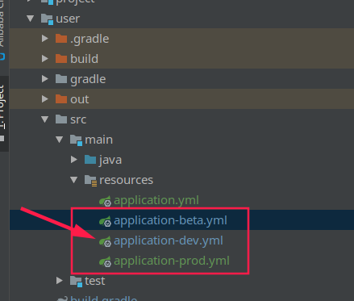

# courage_SpringCloud_Gradle
## notice
项目构建会产生jar包
```shell
./gradlew build -x test # 需要跳过测试
```
或者
```shell
gradle build -x test
```
清理
```shell
gradle clean
```
或者
```shell
./gradlew clean
```


## log 
* 2019/08/28 : 完成gradle各个模块的创建
* 2019/08/29 ：在Project的setting.gradle中注册了module，否则新拉下来的代码的module可能不会成为一个gradle项目，SpringBoot无法运行。更换mvn仓库为阿里云镜像仓库。
* 2019/08/30 ：解决M个module打包成N个jar问题，user模块环境隔离，user模块调用entity模块依赖打包问题解决。lombok在idea中使用问题解决。


## tech

### 环境隔离
在resource文件夹下面依据环境新建一个该环境下的配置文件。生成jar的时候全部都会打包在一起，这点与maven的环境还是有点不一样的，虽然所有文件都会打包，但是启动的时候就会做出选择。
```shell
nohup java -jar user-0.0.1-SNAPSHOT.jar --spring.profiles.active=prod
```
上面的环境变量选择就是application-环境标志.yml

<br/>
虽然这种由SpringBoot自己提供的环境隔离方式可以解决问题，但是很显然有一个安全性问题，打包的时候选择了所有的文件，也就是全部暴露了所有配置信息。不能像maven环境隔离那样只选择所需文件。后期需要解决Gradle的环境隔离，不采用SpringBoot的。